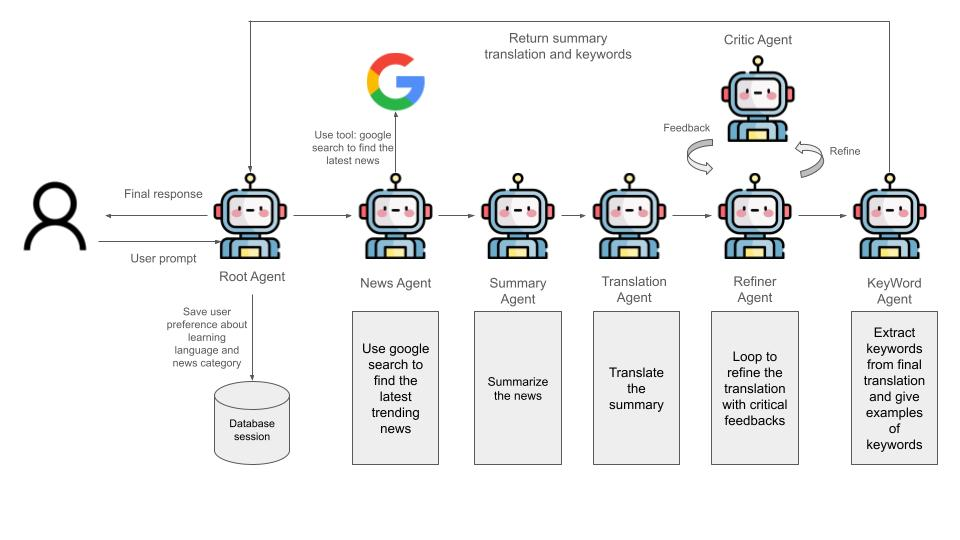

## 📰 LLNS Agent: Language Learning News Summary

The Language Learning News Summary (LLNS) Agent is designed to combine **language acquisition** with **global awareness**. It finds the latest trending news based on user needs, summarizes the news, translates the summary into the user's target language, and provides keywords and examples to facilitate more efficient language learning.



-----

## 🚀 How to Start

Follow these steps to set up and run your LLNS Agent, for either local development or deployment to Vertex AI.

### 1\. 🔑 Set Up Authentication

Before running the agent, you must configure your environment with the necessary API key and Google Cloud Project ID.

1.  **Set Environment Variables:** Replace the placeholders with your actual values and run these commands in your terminal:

    ```bash
    export GOOGLE_API_KEY="<replace your API key here>"
    export GOOGLE_CLOUD_PROJECT="<replace your project ID here>"
    ```

2.  **Authenticate Google Cloud (for Vertex deployment):** If you plan to use the Vertex remote server, ensure you have Application Default Credentials (ADC) set up:

    ```bash
    gcloud auth application-default login
    ```

### 2\. 🖥️ Local Agent Usage

To run the agent locally for development and testing:

```bash
python3 language_learning_news_summary_agent/local_agent.py
```

*Start to interact with your assistant agent\! Enjoy\!*

### 3\. ☁️ Vertex Remote AI Agent Server

To deploy your agent to a scalable Vertex AI endpoint and run the remote client:

1.  **Deploy the Agent Engine:** Run your deployment script (which handles region and project ID configuration):

    ```bash
    sh vertex_deployment.sh
    ```

2.  **Run the Remote Client:** Once deployment is complete, run the remote agent client:

    ```bash
    python3 vertex/remote_agent.py <location you deploy, ex: us-west1>
    ```

    Delete the resource when you don't need it anymore
    ```bash
    python3 python3 vertex/delete_vetex_resource.py <location you deploy, ex: us-west1>
    ```


*Start to interact with your assistant agent\! Enjoy\!*